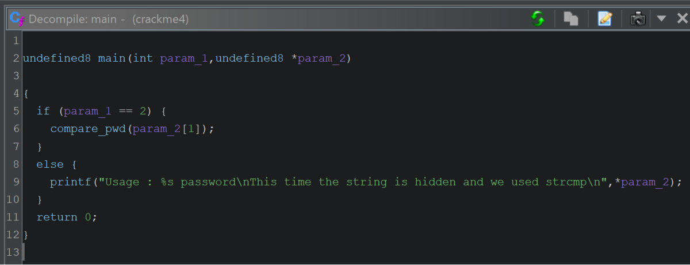
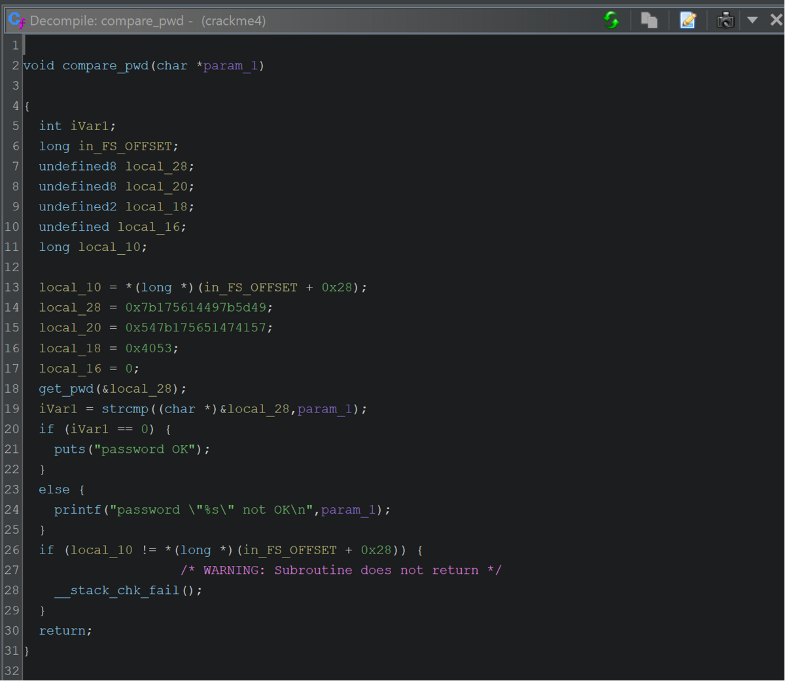
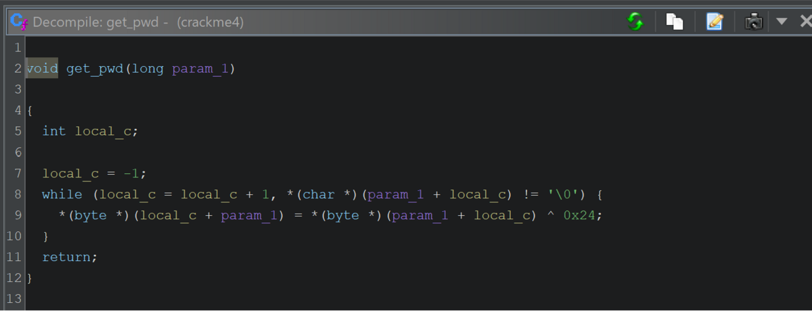
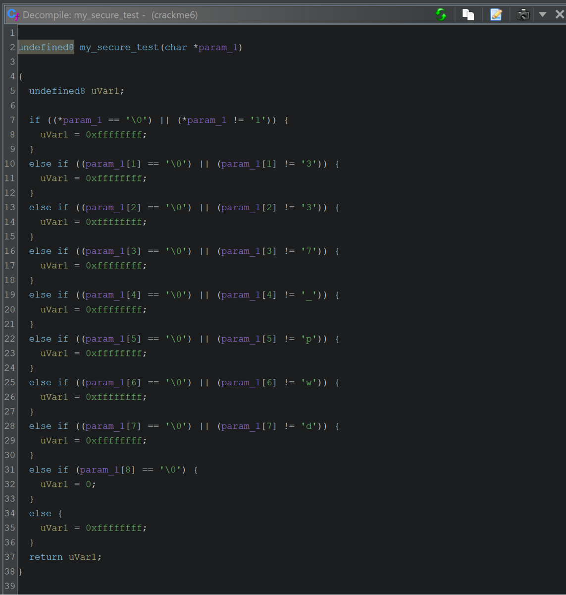

こんにちは、ky0ta168 です。

難易度Easyですが、<a href="https://tryhackme.com/room/reverselfiles" target="_blank" rel="noopener noreferrer">TryHackMe | Reversing ELF</a> を自力で全て解くことができたので、記念にWriteupを残したいと思います。こちらのRoomはCTF形式となっています。

※ コマンド、ツール等の説明はしません。

※ フラグは `x` で伏せています。

## Crackme1

`Download Task Files`をクリックすると `crackme1` をダウンロードできます。(以降の問題も同じようにファイルをダウンロードできるので省略します。)

`Let's start with a basic warmup, can you run the binary?` と書かれているので実行してみます。

```
$ ./crackme1
flag{xxxxxxxxxxxxxxxxxxxx}
```

フラグ取得です。

## Crackme2

とりあえず実行してみます。

```
 $ ./crackme2
Usage: ./crackme2 password
```

コマンドライン引数が必要のようです。

`aaaa` を入力してみます。

```
$ ./crackme2 aaaa
Access denied.
```

が、もちろん `Access denied.` です。

次は `strings` で調査します。

```
$ strings crackme2
... (省略)
Usage: %s password
super_secret_password
Access denied.
Access granted.
...
```

コマンドライン引数を求めるメッセージや、パスワード失敗のメッセージがある中、`super_secret_password` という気になる文字列があります。

`super_secret_password` を入力してみます。

```
$  ./crackme2 super_secret_password
Access granted.
flag{xxxxxxxxxxxxxxxxxxxxxxxxxxxxxxxxxxxxxxxxxxxx}
```

フラグ取得です。

## Crackme3

とりあえず実行してみます。

```
$ ./crackme3
Usage: ./crackme3 PASSWORD
```

コマンドライン引数が必要のようです。

`aaaa` を入力してみます。

```
$ ./crackme3 aaa
Come on, even my aunt Mildred got this one!
```

`strings` で調査します。

```
$ strings crackme3
...(省略)
Usage: %s PASSWORD
malloc failed
ZjByX3kwdXJfNWVjMG5kX2xlNTVvbl91bmJhc2U2NF80bGxfN2gzXzdoMW5nNQ==
Correct password!
Come on, even my aunt Mildred got this one!
ABCDEFGHIJKLMNOPQRSTUVWXYZabcdefghijklmnopqrstuvwxyz0123456789+/
...
```

`ZjByX3kwdXJfNWVjMG5kX2xlNTVvbl91bmJhc2U2NF80bGxfN2gzXzdoMW5nNQ==` が Base64 エンコードされていそうなので、デコードしてみます。

(Base64 については <a href="https://qiita.com/PlanetMeron/items/2905e2d0aa7fe46a36d4" target="_blank" rel="noopener noreferrer">base64ってなんぞ？？理解のために実装してみた</a> が面白くておすすめです。)

```
$ echo "ZjByX3kwdXJfNWVjMG5kX2xlNTVvbl91bmJhc2U2NF80bGxfN2gzXzdoMW5nNQ==" | base64 -d
xxx_xxxx_xxxxxx_xxxxxx_xxxxxxxx_xxx_xxx_xxxxxx
```

```
$ ./crackme3 xxx_xxxx_xxxxxx_xxxxxx_xxxxxxxx_xxx_xxx_xxxxxx
Correct password!
```

`flag{}` のような形式ではありませんが、フラグ取得です。

## Crackme4

とりあえず実行してみます。

```
$ ./crackme4
Usage : ./crackme4 password
This time the string is hidden and we used strcmp
```

コマンドライン引数が必要のようです。

`aaaa` を入力してみます。

```
$  ./crackme4 aaaa
password "aaaa" not OK
```

`strings` では注目するような文字列はなかったため、 Ghidra で調査します。

### main()

`main()` は以下のようになっています。



コマンドライン引数がある場合 `compare_pwd()` にコマンドライン引数を渡しています。

### compare_pwd()

`compare_pwd()` は以下のようになっています。



`get_pwd()` があり、`&local_28` が渡されています。`&local_28` のバイナリをASCII文字列に変換しても印字不可のため、`get_pwd()` のなかで変換されることが予想されます。

その後、`strcmp()` にて、`&local_28` と コマンドライン引数 を比較して、一致している場合、`password OK` が表示されます。

### get_pwd()

`get_pwd()` の中を見てみます。



`&local_28` のバイナリを1文字ずつみて、`'\0'` になるまでループします。
ループの中では`&local_28` のデータを1文字ずつを `0x24` で `xor` しています。

その後 `compare_pwd()` で見たようにコマンドライン引数と比較されるため、`&local_28` のデータを1文字ずつを `0x24` で `xor` された文字列がパスワードとなります。

### Solver

```
$ file crackme4
crackme4: ELF 64-bit LSB executable, x86-64, version 1 (SYSV), dynamically linked, interpreter /lib64/ld-linux-x86-64.so.2, for GNU/Linux 2.6.24, BuildID[sha1]=862ee37793af334043b423ba50ec91cfa132260a, not stripped
```

64bit なので `struct.pack` の際に `"<Q"` を指定する。

Python で Solver を書きました。

```python
import struct

# 0x7B175614497B5D49 などをリトルエンディアンに変換する
key = struct.pack("<Q", 0x7B175614497B5D49)
key += struct.pack("<Q", 0x547B175651474157)
# 余計な 0 が含まれてしまうので "<H" を指定する
key += struct.pack("<H", 0x4053)

# パスワード
pwd = []

# key を1文字ずつ 0x24 で xor をする
for k in key:
    pwd.append(chr(k ^ 0x24))

print("".join(pwd))
```

```
$ python3 solver.py
xx_xxxx_xxxxxx_xxx
```

`flag{}` のような形式ではありませんが、フラグ取得です。

## Crackme5

とりあえず実行してみます。

```
$  ./crackme5
Enter your input:
aaaa
Always dig deeper
```

`strings` では注目するような文字列はなかったため、 `objdump` で調査します。

`main` を見てみたところ、文字列になりそうな部分がありました。

```
$  objdump -d -M intel crackme5 | grep -A65 '<main>:'
...(省略)
  400791:       c6 45 d0 4f             mov    BYTE PTR [rbp-0x30],0x4f
  400795:       c6 45 d1 66             mov    BYTE PTR [rbp-0x2f],0x66
  400799:       c6 45 d2 64             mov    BYTE PTR [rbp-0x2e],0x64
  40079d:       c6 45 d3 6c             mov    BYTE PTR [rbp-0x2d],0x6c
  4007a1:       c6 45 d4 44             mov    BYTE PTR [rbp-0x2c],0x44
  4007a5:       c6 45 d5 53             mov    BYTE PTR [rbp-0x2b],0x53
  4007a9:       c6 45 d6 41             mov    BYTE PTR [rbp-0x2a],0x41
  4007ad:       c6 45 d7 7c             mov    BYTE PTR [rbp-0x29],0x7c
  4007b1:       c6 45 d8 33             mov    BYTE PTR [rbp-0x28],0x33
  4007b5:       c6 45 d9 74             mov    BYTE PTR [rbp-0x27],0x74
  4007b9:       c6 45 da 58             mov    BYTE PTR [rbp-0x26],0x58
  4007bd:       c6 45 db 62             mov    BYTE PTR [rbp-0x25],0x62
  4007c1:       c6 45 dc 33             mov    BYTE PTR [rbp-0x24],0x33
  4007c5:       c6 45 dd 32             mov    BYTE PTR [rbp-0x23],0x32
  4007c9:       c6 45 de 7e             mov    BYTE PTR [rbp-0x22],0x7e
  4007cd:       c6 45 df 58             mov    BYTE PTR [rbp-0x21],0x58
  4007d1:       c6 45 e0 33             mov    BYTE PTR [rbp-0x20],0x33
  4007d5:       c6 45 e1 74             mov    BYTE PTR [rbp-0x1f],0x74
  4007d9:       c6 45 e2 58             mov    BYTE PTR [rbp-0x1e],0x58
  4007dd:       c6 45 e3 40             mov    BYTE PTR [rbp-0x1d],0x40
  4007e1:       c6 45 e4 73             mov    BYTE PTR [rbp-0x1c],0x73
  4007e5:       c6 45 e5 58             mov    BYTE PTR [rbp-0x1b],0x58
  4007e9:       c6 45 e6 60             mov    BYTE PTR [rbp-0x1a],0x60
  4007ed:       c6 45 e7 34             mov    BYTE PTR [rbp-0x19],0x34
  4007f1:       c6 45 e8 74             mov    BYTE PTR [rbp-0x18],0x74
  4007f5:       c6 45 e9 58             mov    BYTE PTR [rbp-0x17],0x58
  4007f9:       c6 45 ea 74             mov    BYTE PTR [rbp-0x16],0x74
  4007fd:       c6 45 eb 7a             mov    BYTE PTR [rbp-0x15],0x7a
...
```

この `[rbp-0x30]` 以降に設定されているバイナリをPythonでASCII文字列に変換してみます。

```python
# [rbp-0x30] に以降に設定されているバイナリ
key = [0x4F, 0x66, 0x64, 0x6C, 0x44, 0x53, 0x41, 0x7C, 0x33, 0x74, 0x58, 0x62, 0x33, 0x32, 0x7E, 0x58, 0x33, 0x74, 0x58, 0x40, 0x73, 0x58, 0x60, 0x34, 0x74, 0x58, 0x74, 0x7A]

# ASCII文字列に変換
for k in key:
    print(chr(k), end="")
```

全て印字可能な文字列でした。

```
$  python3 solver.py
xxxxxxxxxxxxxxxxxxxxxxxxxxxx
```

`crackme5` に入力してみます。

```
$ ./crackme5
Enter your input:
xxxxxxxxxxxxxxxxxxxxxxxxxxxx
Good game
```

`Good game` が出力されました。フラグだったようです。

フラグ取得です。

## Crackme6

とりあえず実行してみます。

```
$ ./crackme6
Usage : ./crackme6 password
Good luck, read the source
```

コマンドライン引数が必要のようです。

```
$ ./crackme6 aaaa
password "aaaa" not OK
```

`strings` では注目するような文字列はなかったため、 Ghidra で調査します。

`main` -> `compare_pwd` -> `my_secure_test` のような流れになっています。

### my_secure_test

`my_secure_test` は以下のようになっています。



コマンドライン引数を1文字ずつ、パスワードと検証しています。

単純に比較している1文字ずつをプログラムに入力してみます。

```
$ ./crackme6 xxxx_xxx
password OK
```

`password OK` となりました。

フラグ取得です。

## Crackme7

とりあえず実行してみます。

```
$ ./crackme7
Menu:

[1] Say hello
[2] Add numbers
[3] Quit

[>]
```

入力した数字によって処理が変わるプログラムのようです。

`nm` でシンボル名を調査します。

```
$ nm crackme7
...(省略)
080486a6 t giveFlag
080484bb T main
...
```

`giveFlag` が気になります。

`objdump` で `main` から `giveFlag` が呼ばれている箇所を調査します

```
$ objdump -d -M intel crackme7 | grep -15 '<giveFlag>'
 8048648:       8b 45 f4                mov    eax,DWORD PTR [ebp-0xc]
 804864b:       83 f8 03                cmp    eax,0x3
 804864e:       75 12                   jne    8048662 <main+0x1a7>
 8048650:       83 ec 0c                sub    esp,0xc
 8048653:       68 b3 88 04 08          push   0x80488b3
 8048658:       e8 13 fd ff ff          call   8048370 <puts@plt>
 804865d:       83 c4 10                add    esp,0x10
 8048660:       eb 35                   jmp    8048697 <main+0x1dc>
 8048662:       8b 45 f4                mov    eax,DWORD PTR [ebp-0xc]
 8048665:       3d 69 7a 00 00          cmp    eax,0x7a69
 804866a:       75 17                   jne    8048683 <main+0x1c8>
 804866c:       83 ec 0c                sub    esp,0xc
 804866f:       68 bc 88 04 08          push   0x80488bc
 8048674:       e8 f7 fc ff ff          call   8048370 <puts@plt>
 8048679:       83 c4 10                add    esp,0x10
 804867c:       e8 25 00 00 00          call   80486a6 <giveFlag>
...(省略)
```

`cmp    eax,0x3` と `cmp    eax,0x7a69` に注目です。 `eax` と `0x3` を比較しているので、`eax` には入力した数字が設定されていることが予想されます。

そのため、`cmp    eax,0x7a69` とあるので、`0x7a69` (31337) を入力することで、`giveFlag` が実行されそうです。

```
$ ./crackme7
Menu:

[1] Say hello
[2] Add numbers
[3] Quit

[>] 31337
Wow such h4x0r!
flag{xxxx_xxxxxxxxx_xxxx_xxx_xxx}
```

フラグ取得です。

## Crackme8

とりあえず実行してみます。

```
$ ./crackme8
Usage: ./crackme8 password
```

コマンドライン引数が必要のようです。

```
$ ./crackme8 aaaa
Access denied.
```

`nm` でシンボル名を調査します。

```
$ nm crackme8
...(省略)
08048524 t giveFlag
0804849b T main
...
```

`giveFlag` が気になります。

`objdump` で `main` から `giveFlag` が呼ばれている箇所を調査します

```
$ objdump -d -M intel crackme8 | grep -15 '<giveFlag>'
 80484db:       50                      push   eax
 80484dc:       e8 9f fe ff ff          call   8048380 <atoi@plt>
 80484e1:       83 c4 10                add    esp,0x10
 80484e4:       3d 0d f0 fe ca          cmp    eax,0xcafef00d
 80484e9:       74 17                   je     8048502 <main+0x67>
 80484eb:       83 ec 0c                sub    esp,0xc
 80484ee:       68 74 86 04 08          push   0x8048674
 80484f3:       e8 58 fe ff ff          call   8048350 <puts@plt>
 80484f8:       83 c4 10                add    esp,0x10
 80484fb:       b8 01 00 00 00          mov    eax,0x1
 8048500:       eb 1a                   jmp    804851c <main+0x81>
 8048502:       83 ec 0c                sub    esp,0xc
 8048505:       68 83 86 04 08          push   0x8048683
 804850a:       e8 41 fe ff ff          call   8048350 <puts@plt>
 804850f:       83 c4 10                add    esp,0x10
 8048512:       e8 0d 00 00 00          call   8048524 <giveFlag>
...(省略)
```

`push eax` `call   8048380 <atoi@plt>` `cmp    eax,0xcafef00d` が注目ポイントです。コマンドライン引数が `atoi` に渡され、それを `0xcafef00d` と比較しています。

`0xcafef00d` を10進数に変換して、入力してみます。

```
$ python3
>>> int(0xcafef00d)
3405705229
```

```
$ ./crackme8 3405705229
Access denied.
```

間違っているようです。符号付の可能性があるので、下記のように変換して入力してみます。

```
$ python3
>>> ~(0xcafef00d ^ 0xffffffff)
-889262067
```

```
$ ./crackme8 -889262067
Access granted.
flag{xx_xxxxx_xxxx_xxxx_xxxx_xxxx_xxxx_xxxxxx_xxxx_xxxxxxx}
```

フラグ取得しました。

## 感想

Reversing の初心者におすすめな問題でした。

Ghidra は便利ですね。
