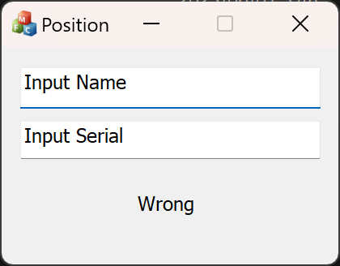
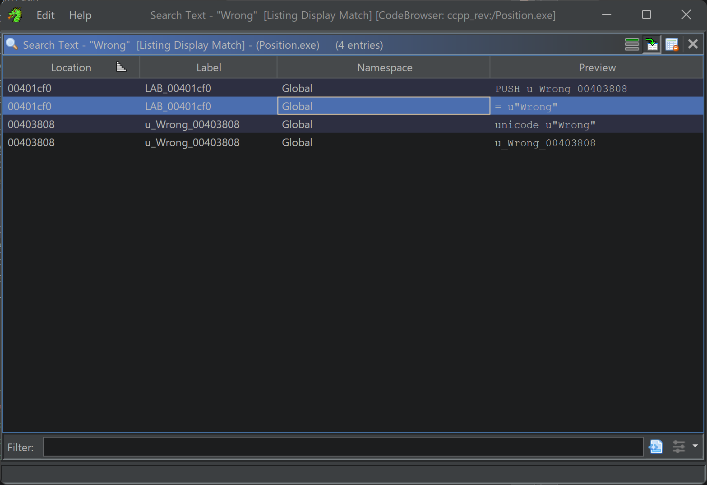
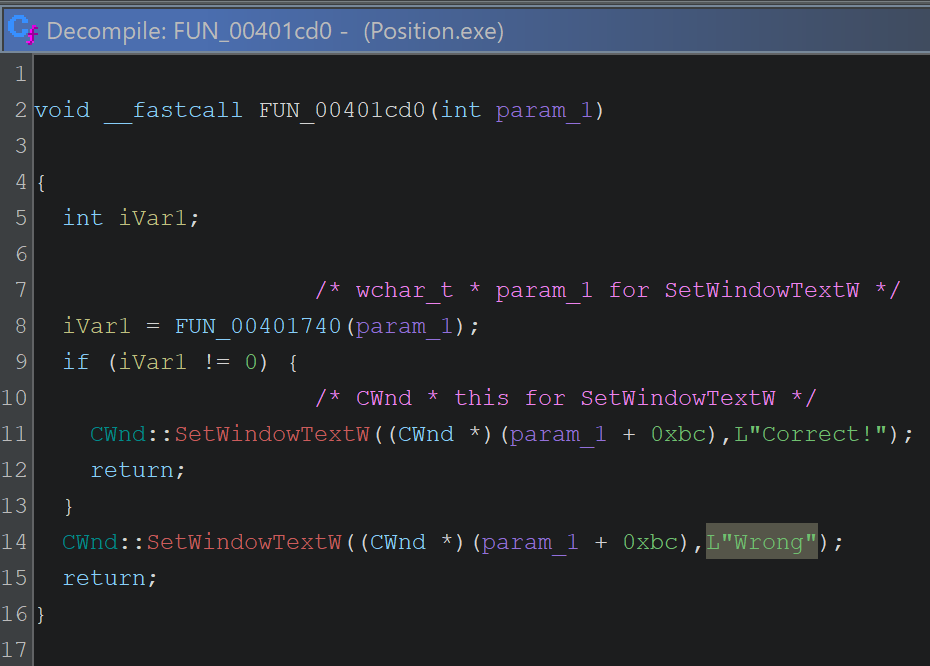
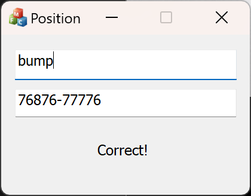
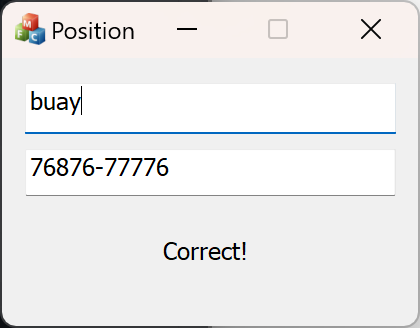

こんにちは、ky0ta168 です。

「<a href="http://reversing.kr/challenge.php" target="_blank" rel="noopener noreferrer">Reversing.Kr - Position</a>」をかなり時間がかかりましたが、試行錯誤して解けて達成感があったため、Writeupを残したいと思います。

※ コマンド、ツール等の説明はしません。

※ 私の推測が含まれるため、記載内容が正しいとは限りません。

## とりあえず実行

配布された`Position.exe`を実行します。



正しい`Name`と`Serial`を入力したら良いと推測できます。

配布されるファイルに、`ReadMe.txt`があります。

> ReversingKr KeygenMe
>
>
> Find the Name when the Serial is 76876-77776
> This problem has several answers.
>
> Password is ***p

`Serial`が`76876-77776`の場合、`Name`は何になるかという問題のようです。

また、`Password is ***p`とあるので、4文字でかつ末尾が`p`となることが推測できます。

## Ghidraで分析

Ghidraで`Position.exe`を解析します。

### 判定付近のコードを調査

実行してみた結果、正しくない`Name`と`Serial`を入力した場合、`Wrong`と表示されることがわかりました。

`Wrong`を検索してみます。



2行目のデコンパイル結果を見てみます。



`FUN_00401740`の結果をもとに、`Correct!`と`Wrong`の表示を切り替えていることがわかりました。

### 判定コードを調査

`FUN_00401740`のデコンパイル結果を見てみます。

```c title='FUN_00401740' wrap=false
undefined4 FUN_00401740(int param_1)

{
  byte bVar1;
  byte bVar2;
  wchar_t wVar3;
  wchar_t wVar4;
  wchar_t *pwVar5;
  int iVar6;
  int iVar7;
  size_t sVar8;
  int local_1c;
  int local_18;
  CStringT<> local_14 [4];
  void *local_10;
  undefined1 *puStack_c;
  undefined4 local_8;

  local_8 = 0xffffffff;
  puStack_c = &LAB_00402acb;
  local_10 = ExceptionList;
                    /* CStringT<wchar_t,class_StrTraitMFC_DLL<wchar_t,class_ATL::ChTraitsCRT<wchar_t >_>_>
                       * param_1 for GetWindowTextW */
                    /* CStringT<wchar_t,class_StrTraitMFC_DLL<wchar_t,class_ATL::ChTraitsCRT<wchar_t >_>_>
                       * this for
                       CStringT<wchar_t,class_StrTraitMFC_DLL<wchar_t,class_ATL::ChTraitsCRT<wchar_t >_>_>
                        */
                    /* CStringT<wchar_t,class_StrTraitMFC_DLL<wchar_t,class_ATL::ChTraitsCRT<wchar_t >_>_>
                       * this for
                       CStringT<wchar_t,class_StrTraitMFC_DLL<wchar_t,class_ATL::ChTraitsCRT<wchar_t >_>_>
                        */
                    /* CStringT<wchar_t,class_StrTraitMFC_DLL<wchar_t,class_ATL::ChTraitsCRT<wchar_t >_>_>
                       * this for
                       CStringT<wchar_t,class_StrTraitMFC_DLL<wchar_t,class_ATL::ChTraitsCRT<wchar_t >_>_>
                        */
  ExceptionList = &local_10;
  ATL::CStringT<>::CStringT<>((CStringT<> *)&local_1c);
  iVar7 = 0;
  local_8 = 0;
  ATL::CStringT<>::CStringT<>((CStringT<> *)&local_18);
  ATL::CStringT<>::CStringT<>(local_14);
                    /* CWnd * this for GetWindowTextW */
  local_8 = CONCAT31(local_8._1_3_,2);
  CWnd::GetWindowTextW((CWnd *)(param_1 + 0x130),(CStringT<> *)&local_1c);
  if (*(int *)(local_1c + -0xc) == 4) {
    iVar6 = 0;
    do {
                    /* CSimpleStringT<wchar_t,1> * this for GetAt */
      wVar3 = ATL::CSimpleStringT<wchar_t,1>::GetAt((CSimpleStringT<wchar_t,1> *)&local_1c,iVar6);
      if (((ushort)wVar3 < 0x61) ||
         (wVar3 = ATL::CSimpleStringT<wchar_t,1>::GetAt
                            ((CSimpleStringT<wchar_t,1> *)&local_1c,iVar6), 0x7a < (ushort)wVar3))
      goto LAB_004017ab;
      iVar6 = iVar6 + 1;
    } while (iVar6 < 4);
    do {
      iVar6 = 0;
      do {
        if (iVar7 != iVar6) {
          wVar3 = ATL::CSimpleStringT<wchar_t,1>::GetAt
                            ((CSimpleStringT<wchar_t,1> *)&local_1c,iVar6);
          wVar4 = ATL::CSimpleStringT<wchar_t,1>::GetAt
                            ((CSimpleStringT<wchar_t,1> *)&local_1c,iVar7);
          if (wVar4 == wVar3) goto LAB_004017ab;
        }
        iVar6 = iVar6 + 1;
      } while (iVar6 < 4);
      iVar7 = iVar7 + 1;
    } while (iVar7 < 4);
    CWnd::GetWindowTextW((CWnd *)(param_1 + 0x1a4),(CStringT<> *)&local_18);
    if ((*(int *)(local_18 + -0xc) == 0xb) &&
       (wVar3 = ATL::CSimpleStringT<wchar_t,1>::GetAt((CSimpleStringT<wchar_t,1> *)&local_18,5),
       wVar3 == L'-')) {
      wVar3 = ATL::CSimpleStringT<wchar_t,1>::GetAt((CSimpleStringT<wchar_t,1> *)&local_1c,0);
      bVar1 = (byte)wVar3;
      wVar3 = ATL::CSimpleStringT<wchar_t,1>::GetAt((CSimpleStringT<wchar_t,1> *)&local_1c,1);
      bVar2 = (byte)wVar3;
      iVar7 = 10;
                    /* int param_1 for GetBuffer */
      sVar8 = 10;
                    /* CSimpleStringT<wchar_t,1> * this for GetBuffer */
      pwVar5 = ATL::CSimpleStringT<wchar_t,1>::GetBuffer((CSimpleStringT<wchar_t,1> *)local_14,10);
      _itow_s((uint)(byte)((bVar2 >> 2 & 1) + 1) + (uint)(byte)((bVar1 & 1) + 5),pwVar5,sVar8,iVar7)
      ;
      wVar3 = ATL::CSimpleStringT<wchar_t,1>::GetAt((CSimpleStringT<wchar_t,1> *)local_14,0);
      wVar4 = ATL::CSimpleStringT<wchar_t,1>::GetAt((CSimpleStringT<wchar_t,1> *)&local_18,0);
      if (wVar4 == wVar3) {
        ATL::CSimpleStringT<wchar_t,1>::ReleaseBuffer((CSimpleStringT<wchar_t,1> *)local_14,-1);
        iVar7 = 10;
                    /* int param_1 for GetBuffer */
        sVar8 = 10;
                    /* CSimpleStringT<wchar_t,1> * this for GetBuffer */
        pwVar5 = ATL::CSimpleStringT<wchar_t,1>::GetBuffer((CSimpleStringT<wchar_t,1> *)local_14,10)
        ;
        _itow_s((uint)(byte)((bVar2 >> 3 & 1) + 1) + (uint)(byte)((bVar1 >> 3 & 1) + 5),pwVar5,sVar8
                ,iVar7);
        wVar3 = ATL::CSimpleStringT<wchar_t,1>::GetAt((CSimpleStringT<wchar_t,1> *)&local_18,1);
        wVar4 = ATL::CSimpleStringT<wchar_t,1>::GetAt((CSimpleStringT<wchar_t,1> *)local_14,0);
        if (wVar3 == wVar4) {
          ATL::CSimpleStringT<wchar_t,1>::ReleaseBuffer((CSimpleStringT<wchar_t,1> *)local_14,-1);
          iVar7 = 10;
                    /* int param_1 for GetBuffer */
          sVar8 = 10;
                    /* CSimpleStringT<wchar_t,1> * this for GetBuffer */
          pwVar5 = ATL::CSimpleStringT<wchar_t,1>::GetBuffer
                             ((CSimpleStringT<wchar_t,1> *)local_14,10);
          _itow_s((uint)(byte)((bVar2 >> 4 & 1) + 1) + (uint)(byte)((bVar1 >> 1 & 1) + 5),pwVar5,
                  sVar8,iVar7);
          wVar3 = ATL::CSimpleStringT<wchar_t,1>::GetAt((CSimpleStringT<wchar_t,1> *)&local_18,2);
          wVar4 = ATL::CSimpleStringT<wchar_t,1>::GetAt((CSimpleStringT<wchar_t,1> *)local_14,0);
          if (wVar3 == wVar4) {
            ATL::CSimpleStringT<wchar_t,1>::ReleaseBuffer((CSimpleStringT<wchar_t,1> *)local_14,-1);
            iVar7 = 10;
                    /* int param_1 for GetBuffer */
            sVar8 = 10;
                    /* CSimpleStringT<wchar_t,1> * this for GetBuffer */
            pwVar5 = ATL::CSimpleStringT<wchar_t,1>::GetBuffer
                               ((CSimpleStringT<wchar_t,1> *)local_14,10);
            _itow_s((uint)(byte)((bVar2 & 1) + 1) + (uint)(byte)((bVar1 >> 2 & 1) + 5),pwVar5,sVar8,
                    iVar7);
            wVar3 = ATL::CSimpleStringT<wchar_t,1>::GetAt((CSimpleStringT<wchar_t,1> *)&local_18,3);
            wVar4 = ATL::CSimpleStringT<wchar_t,1>::GetAt((CSimpleStringT<wchar_t,1> *)local_14,0);
            if (wVar3 == wVar4) {
              ATL::CSimpleStringT<wchar_t,1>::ReleaseBuffer
                        ((CSimpleStringT<wchar_t,1> *)local_14,-1);
              iVar7 = 10;
                    /* int param_1 for GetBuffer */
              sVar8 = 10;
                    /* CSimpleStringT<wchar_t,1> * this for GetBuffer */
              pwVar5 = ATL::CSimpleStringT<wchar_t,1>::GetBuffer
                                 ((CSimpleStringT<wchar_t,1> *)local_14,10);
              _itow_s((uint)(byte)((bVar2 >> 1 & 1) + 1) + (uint)(byte)((bVar1 >> 4 & 1) + 5),pwVar5
                      ,sVar8,iVar7);
              wVar3 = ATL::CSimpleStringT<wchar_t,1>::GetAt
                                ((CSimpleStringT<wchar_t,1> *)&local_18,4);
              wVar4 = ATL::CSimpleStringT<wchar_t,1>::GetAt((CSimpleStringT<wchar_t,1> *)local_14,0)
              ;
              if (wVar3 == wVar4) {
                ATL::CSimpleStringT<wchar_t,1>::ReleaseBuffer
                          ((CSimpleStringT<wchar_t,1> *)local_14,-1);
                wVar3 = ATL::CSimpleStringT<wchar_t,1>::GetAt
                                  ((CSimpleStringT<wchar_t,1> *)&local_1c,2);
                bVar1 = (byte)wVar3;
                wVar3 = ATL::CSimpleStringT<wchar_t,1>::GetAt
                                  ((CSimpleStringT<wchar_t,1> *)&local_1c,3);
                bVar2 = (byte)wVar3;
                iVar7 = 10;
                    /* int param_1 for GetBuffer */
                sVar8 = 10;
                    /* CSimpleStringT<wchar_t,1> * this for GetBuffer */
                pwVar5 = ATL::CSimpleStringT<wchar_t,1>::GetBuffer
                                   ((CSimpleStringT<wchar_t,1> *)local_14,10);
                _itow_s((uint)(byte)((bVar2 >> 2 & 1) + 1) + (uint)(byte)((bVar1 & 1) + 5),pwVar5,
                        sVar8,iVar7);
                wVar3 = ATL::CSimpleStringT<wchar_t,1>::GetAt
                                  ((CSimpleStringT<wchar_t,1> *)&local_18,6);
                wVar4 = ATL::CSimpleStringT<wchar_t,1>::GetAt
                                  ((CSimpleStringT<wchar_t,1> *)local_14,0);
                if (wVar3 == wVar4) {
                  ATL::CSimpleStringT<wchar_t,1>::ReleaseBuffer
                            ((CSimpleStringT<wchar_t,1> *)local_14,-1);
                  iVar7 = 10;
                    /* int param_1 for GetBuffer */
                  sVar8 = 10;
                    /* CSimpleStringT<wchar_t,1> * this for GetBuffer */
                  pwVar5 = ATL::CSimpleStringT<wchar_t,1>::GetBuffer
                                     ((CSimpleStringT<wchar_t,1> *)local_14,10);
                  _itow_s((uint)(byte)((bVar2 >> 3 & 1) + 1) + (uint)(byte)((bVar1 >> 3 & 1) + 5),
                          pwVar5,sVar8,iVar7);
                  wVar3 = ATL::CSimpleStringT<wchar_t,1>::GetAt
                                    ((CSimpleStringT<wchar_t,1> *)&local_18,7);
                  wVar4 = ATL::CSimpleStringT<wchar_t,1>::GetAt
                                    ((CSimpleStringT<wchar_t,1> *)local_14,0);
                  if (wVar3 == wVar4) {
                    ATL::CSimpleStringT<wchar_t,1>::ReleaseBuffer
                              ((CSimpleStringT<wchar_t,1> *)local_14,-1);
                    iVar7 = 10;
                    /* int param_1 for GetBuffer */
                    sVar8 = 10;
                    /* CSimpleStringT<wchar_t,1> * this for GetBuffer */
                    pwVar5 = ATL::CSimpleStringT<wchar_t,1>::GetBuffer
                                       ((CSimpleStringT<wchar_t,1> *)local_14,10);
                    _itow_s((uint)(byte)((bVar2 >> 4 & 1) + 1) + (uint)(byte)((bVar1 >> 1 & 1) + 5),
                            pwVar5,sVar8,iVar7);
                    wVar3 = ATL::CSimpleStringT<wchar_t,1>::GetAt
                                      ((CSimpleStringT<wchar_t,1> *)&local_18,8);
                    wVar4 = ATL::CSimpleStringT<wchar_t,1>::GetAt
                                      ((CSimpleStringT<wchar_t,1> *)local_14,0);
                    if (wVar3 == wVar4) {
                      ATL::CSimpleStringT<wchar_t,1>::ReleaseBuffer
                                ((CSimpleStringT<wchar_t,1> *)local_14,-1);
                      iVar7 = 10;
                    /* int param_1 for GetBuffer */
                      sVar8 = 10;
                    /* CSimpleStringT<wchar_t,1> * this for GetBuffer */
                      pwVar5 = ATL::CSimpleStringT<wchar_t,1>::GetBuffer
                                         ((CSimpleStringT<wchar_t,1> *)local_14,10);
                      _itow_s((uint)(byte)((bVar2 & 1) + 1) + (uint)(byte)((bVar1 >> 2 & 1) + 5),
                              pwVar5,sVar8,iVar7);
                      wVar3 = ATL::CSimpleStringT<wchar_t,1>::GetAt
                                        ((CSimpleStringT<wchar_t,1> *)&local_18,9);
                      wVar4 = ATL::CSimpleStringT<wchar_t,1>::GetAt
                                        ((CSimpleStringT<wchar_t,1> *)local_14,0);
                      if (wVar3 == wVar4) {
                        ATL::CSimpleStringT<wchar_t,1>::ReleaseBuffer
                                  ((CSimpleStringT<wchar_t,1> *)local_14,-1);
                        iVar7 = 10;
                    /* int param_1 for GetBuffer */
                        sVar8 = 10;
                    /* CSimpleStringT<wchar_t,1> * this for GetBuffer */
                        pwVar5 = ATL::CSimpleStringT<wchar_t,1>::GetBuffer
                                           ((CSimpleStringT<wchar_t,1> *)local_14,10);
                        _itow_s((uint)(byte)((bVar2 >> 1 & 1) + 1) +
                                (uint)(byte)((bVar1 >> 4 & 1) + 5),pwVar5,sVar8,iVar7);
                        wVar3 = ATL::CSimpleStringT<wchar_t,1>::GetAt
                                          ((CSimpleStringT<wchar_t,1> *)&local_18,10);
                        wVar4 = ATL::CSimpleStringT<wchar_t,1>::GetAt
                                          ((CSimpleStringT<wchar_t,1> *)local_14,0);
                        if (wVar3 == wVar4) {
                          ATL::CSimpleStringT<wchar_t,1>::ReleaseBuffer
                                    ((CSimpleStringT<wchar_t,1> *)local_14,-1);
                          ATL::CStringT<>::~CStringT<>(local_14);
                          ATL::CStringT<>::~CStringT<>((CStringT<> *)&local_18);
                          ATL::CStringT<>::~CStringT<>((CStringT<> *)&local_1c);
                          ExceptionList = local_10;
                          return 1;
                        }
                      }
                    }
                  }
                }
              }
            }
          }
        }
      }
    }
  }
LAB_004017ab:
  ATL::CStringT<>::~CStringT<>(local_14);
  ATL::CStringT<>::~CStringT<>((CStringT<> *)&local_18);
  ATL::CStringT<>::~CStringT<>((CStringT<> *)&local_1c);
  ExceptionList = local_10;
  return 0;
}
```

#### 文字数について

`ReadMe.txt`より、`Name`が4文字になることがわかっているので、下記のコード(45行目付近)で判定していると推測できます。

```c wrap=false startLineNumber=45
if (*(int *)(local_1c + -0xc) == 4) {
```

`CWnd::GetWindowTextW`で取得した値が、`local_1c`に格納されています。

よって、`local_1c`には`Name`が格納されています。

<a href="https://learn.microsoft.com/ja-jp/cpp/mfc/reference/cwnd-class?view=msvc-170#getwindowtext" target="_blank" rel="noopener noreferrer">CWnd クラス | Microsoft Learn - CWnd::GetWindowText</a>

#### 文字種について

下記コード(46行目付近)より、入力された`Name`を1文字ずつ`a` ~ `z`であるか確認しているため、`Name`は英小文字であることがわかります。

<a href="https://learn.microsoft.com/ja-jp/cpp/atl-mfc-shared/reference/csimplestringt-class?view=msvc-170#getat" target="_blank" rel="noopener noreferrer">CSimpleStringT クラス | Microsoft Learn - CSimpleStringT::GetAt</a>

```c wrap=false startLineNumber=46
iVar6 = 0;
do {
                /* CSimpleStringT<wchar_t,1> * this for GetAt */
  wVar3 = ATL::CSimpleStringT<wchar_t,1>::GetAt((CSimpleStringT<wchar_t,1> *)&local_1c,iVar6);
  if (((ushort)wVar3 < 0x61) ||
      (wVar3 = ATL::CSimpleStringT<wchar_t,1>::GetAt
                        ((CSimpleStringT<wchar_t,1> *)&local_1c,iVar6), 0x7a < (ushort)wVar3))
  goto LAB_004017ab;
  iVar6 = iVar6 + 1;
} while (iVar6 < 4);
```

#### `Serial`について

下記コード(70行目付近)より、`GetWindowTextW`で取得した値の6文字目を`'-'`と比較しているため、`Serial`であることが推測できます。

よって、`local_18`には`Serial`の値が格納されていることがわかります。

```c wrap=false startLineNumber=70
CWnd::GetWindowTextW((CWnd *)(param_1 + 0x1a4),(CStringT<> *)&local_18);
if ((*(int *)(local_18 + -0xc) == 0xb) &&
    (wVar3 = ATL::CSimpleStringT<wchar_t,1>::GetAt((CSimpleStringT<wchar_t,1> *)&local_18,5),
    wVar3 == L'-'))
```

#### 判定処理

前述のとおり、`local_1c`には`Name`が格納されてるため、下記コード(74行目付近)より、`Name`の1文字目と2文字目をそれぞれ、`bVar1`、`bVar2`に格納していることがわかります。

```c wrap=false startLineNumber=74
wVar3 = ATL::CSimpleStringT<wchar_t,1>::GetAt((CSimpleStringT<wchar_t,1> *)&local_1c,0);
bVar1 = (byte)wVar3;
wVar3 = ATL::CSimpleStringT<wchar_t,1>::GetAt((CSimpleStringT<wchar_t,1> *)&local_1c,1);
bVar2 = (byte)wVar3;
```

そして、下記コード(78行目付近)では`Name`の1文字目と2文字目を使い、`>>`や`&`を行った値を`pwVar5`に格納しています。

`pwVar5`は、`local14`を用いて`GetBuffer`を行った戻り値のポインタです。


<a href="https://learn.microsoft.com/ja-jp/cpp/atl-mfc-shared/reference/csimplestringt-class?view=msvc-170#getbuffer" target="_blank" rel="noopener noreferrer">CSimpleStringT クラス | Microsoft Learn - CSimpleStringT::GetBuffer</a>

```c wrap=false startLineNumber=78
iVar7 = 10;
              /* int param_1 for GetBuffer */
sVar8 = 10;
              /* CSimpleStringT<wchar_t,1> * this for GetBuffer */
pwVar5 = ATL::CSimpleStringT<wchar_t,1>::GetBuffer((CSimpleStringT<wchar_t,1> *)local_14,10);
_itow_s((uint)(byte)((bVar2 >> 2 & 1) + 1) + (uint)(byte)((bVar1 & 1) + 5),pwVar5,sVar8,iVar7)
;
```

続いて、判定の箇所です。(85行目付近)

`local_14`(`Name`の1文字目と2文字目を使い変換した値)の1文字目と`local_8`(`Serial`)の1文字目を比較して正しければ、次の文字の判定へ、誤っていれば`return 0;`となります。


```c wrap=false startLineNumber=85
wVar3 = ATL::CSimpleStringT<wchar_t,1>::GetAt((CSimpleStringT<wchar_t,1> *)local_14,0);
wVar4 = ATL::CSimpleStringT<wchar_t,1>::GetAt((CSimpleStringT<wchar_t,1> *)&local_18,0);
if (wVar4 == wVar3) {
```

この後のコードでも、`Name`に対して`>>`や`&`などを行い、判定処理が続いていきます。

## Solver

今回は、`Name`が4文字でかつ、末尾が`p`であることがわかっているので、総当たりを行い答えを出しました。

```python wrap=false
import string
from itertools import product

input_serial = "76876-77776"
letters = string.ascii_lowercase

for i, j, k, l in product(letters, repeat=4):
    name = f"{i}{j}{k}{l}"
    if name[3] != "p":
        continue

    bVar1 = ord(name[0])
    bVar2 = ord(name[1])

    # 前半部分のチェック（input_serial の 0〜4）
    tmp_cmp = ((bVar2 >> 2 & 1) + 1) + ((bVar1 & 1) + 5)
    if str(tmp_cmp) != input_serial[0]:
        continue

    tmp_cmp = ((bVar2 >> 3 & 1) + 1) + ((bVar1 >> 3 & 1) + 5)
    if str(tmp_cmp) != input_serial[1]:
        continue

    tmp_cmp = ((bVar2 >> 4 & 1) + 1) + ((bVar1 >> 1 & 1) + 5)
    if str(tmp_cmp) != input_serial[2]:
        continue

    tmp_cmp = ((bVar2 & 1) + 1) + ((bVar1 >> 2 & 1) + 5)
    if str(tmp_cmp) != input_serial[3]:
        continue

    tmp_cmp = ((bVar2 >> 1 & 1) + 1) + ((bVar1 >> 4 & 1) + 5)
    if str(tmp_cmp) != input_serial[4]:
        continue

    # ハイフンを飛ばして後半（input_serial の 6〜10）
    bVar1 = ord(name[2])
    bVar2 = ord(name[3])

    tmp_cmp = ((bVar2 >> 2 & 1) + 1) + ((bVar1 & 1) + 5)
    if str(tmp_cmp) != input_serial[6]:
        continue

    tmp_cmp = ((bVar2 >> 3 & 1) + 1) + ((bVar1 >> 3 & 1) + 5)
    if str(tmp_cmp) != input_serial[7]:
        continue

    tmp_cmp = ((bVar2 >> 4 & 1) + 1) + ((bVar1 >> 1 & 1) + 5)
    if str(tmp_cmp) != input_serial[8]:
        continue

    tmp_cmp = ((bVar2 & 1) + 1) + ((bVar1 >> 2 & 1) + 5)
    if str(tmp_cmp) != input_serial[9]:
        continue

    tmp_cmp = ((bVar2 >> 1 & 1) + 1) + ((bVar1 >> 4 & 1) + 5)
    if str(tmp_cmp) != input_serial[10]:
        continue

    print(name)
```

### 実行結果

```bash
$ python solver.py
bump
cqmp
ftmp
gpmp
```

いくつか答えが出力されました。

結果的には`gpmp`以外は`Correct!`と表示され、無事Flagを取得しました。



## おまけ

デコンパイル結果を見た感じ、末尾が`p`である必要は特にないように見受けられました。

判定処理で正しければ良いので、末尾が`p`かどうかのコードをコメントアウトし実行した結果、結構多くの答えが出力されました。

<details>

<summary>
末尾の判定をコメントアウトしたSolver
</summary>

```python wrap=false
import string
from itertools import product

input_serial = "76876-77776"
letters = string.ascii_lowercase

for i, j, k, l in product(letters, repeat=4):
    name = f"{i}{j}{k}{l}"
    # if name[3] != "p":
    #     continue

    bVar1 = ord(name[0])
    bVar2 = ord(name[1])

    # 前半部分のチェック（input_serial の 0〜4）
    tmp_cmp = ((bVar2 >> 2 & 1) + 1) + ((bVar1 & 1) + 5)
    if str(tmp_cmp) != input_serial[0]:
        continue

    tmp_cmp = ((bVar2 >> 3 & 1) + 1) + ((bVar1 >> 3 & 1) + 5)
    if str(tmp_cmp) != input_serial[1]:
        continue

    tmp_cmp = ((bVar2 >> 4 & 1) + 1) + ((bVar1 >> 1 & 1) + 5)
    if str(tmp_cmp) != input_serial[2]:
        continue

    tmp_cmp = ((bVar2 & 1) + 1) + ((bVar1 >> 2 & 1) + 5)
    if str(tmp_cmp) != input_serial[3]:
        continue

    tmp_cmp = ((bVar2 >> 1 & 1) + 1) + ((bVar1 >> 4 & 1) + 5)
    if str(tmp_cmp) != input_serial[4]:
        continue

    # ハイフンを飛ばして後半（input_serial の 6〜10）
    bVar1 = ord(name[2])
    bVar2 = ord(name[3])

    tmp_cmp = ((bVar2 >> 2 & 1) + 1) + ((bVar1 & 1) + 5)
    if str(tmp_cmp) != input_serial[6]:
        continue

    tmp_cmp = ((bVar2 >> 3 & 1) + 1) + ((bVar1 >> 3 & 1) + 5)
    if str(tmp_cmp) != input_serial[7]:
        continue

    tmp_cmp = ((bVar2 >> 4 & 1) + 1) + ((bVar1 >> 1 & 1) + 5)
    if str(tmp_cmp) != input_serial[8]:
        continue

    tmp_cmp = ((bVar2 & 1) + 1) + ((bVar1 >> 2 & 1) + 5)
    if str(tmp_cmp) != input_serial[9]:
        continue

    tmp_cmp = ((bVar2 >> 1 & 1) + 1) + ((bVar1 >> 4 & 1) + 5)
    if str(tmp_cmp) != input_serial[10]:
        continue

    print(name)

```

</details>

実行結果は下記になりました。

```bash
$ python solver.py
buay
bubm
buci
buex
bufl
bugh
buhu
buiq
buje
buka
bult
bump
bund
cqay
cqbm
cqci
cqex
cqfl
cqgh
cqhu
cqiq
cqje
cqka
cqlt
cqmp
cqnd
ftay
ftbm
ftci
ftex
ftfl
ftgh
fthu
ftiq
ftje
ftka
ftlt
ftmp
ftnd
gpay
gpbm
gpci
gpex
gpfl
gpgh
gphu
gpiq
gpje
gpka
gplt
gpmp
gpnd
```

試しに、`buay`を入力したところ、`Correct!`が表示されたため推測は当たっていました。



ただし、出力された答えの中でも、`gpmp`と同様に`Wrong`と表示されてしまう文字列もありました。

## 終わりに

今回の問題を解いて、判定処理の特定や判定処理を読む力が鍛えられたかと思います。

また、プライベートの時間がそこまで取れない中、4日くらいかけて解きました。1回1回どこまでわかったか、次はなにを調査するかなどをメモしながら進めることができました。

コードリーディングのような集中力が必要な作業が、時間がない中でもできることがわかり、良い収穫となりました。

やる気が出たら、`gpmp`はなぜ`Wrong`となってしまうのか、調査したいと思います。
